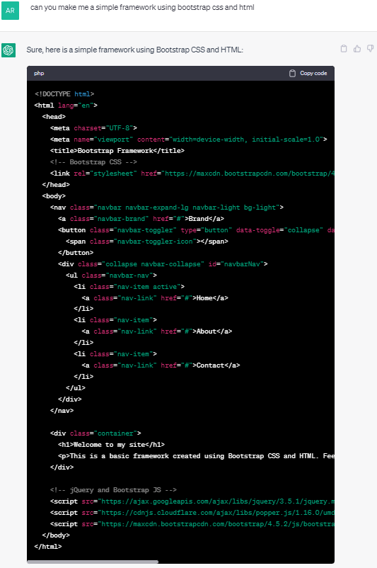

# Michael Karle Front-End Web Design - Project 2

## Integration of ChatGPT
This project was my first experience using ChatGPT, so I initially started experimenting with simple prompts such as 'create me a website using html and css.' I found that ChatGPT would generate working websites, but needed specificity of what to generate in order to create something I could use. I hadn't used a front-end framework before so I decided to experiment with generating a site with bootstrap integrated. I used the simple prompt 'can you make me a simple framework using bootstrap css and html' a couple times, and found a template that served as a good building block. Whenever I tried to use ChatGPT to generate a more complex template, it would often miss elements or hit its character limit, so I had to keep the prompt simple. 

The original template generated by ChatGPT was the following; 

The AI also labelled some elements in this template, which helped me understand Bootstrap as I learnt the system. I found the template had a few mistakes, but was overall well made and functioned without any changes. It did however lack some semantic tags such as header or footer, but adding those provided a good opportunity to build on the template. The AI also was able to use Javascript in the creation of a hamburger menu, which is something I struggled with in the last assignment. This made ChatGPT invaluable for improving my site by adding functionality and a reactive menu.

I additionally used ChatGPT to generate all the large paragraphs and content on my site. ChatGPT was especially useful in saving me time and research, as it compiled all the important facts into a small paragraph. The AI was especially useful here, as it cut down massively on my workload.

## Usage of Bootstrap
This was my first experience using bootstrap, but I found the framework very helpful and easy to work with. I used it for its column system, as well as its shortcuts for navigation and general quality of life improvements. Specifically, I made usage of the 'container-fluid' tag in order to easily make all my elements span the width of the page. The usage of the 12-column system also sped up my coding, as I didn't have to alter the alignment settings of each div or class. As shown in my CSS, I unpacked the original bootstrap used in the template, and changed a few classes to create a layout that better suited my site while still using bootstrap. There were times when I found bootstrap difficult to understand, as many tags seemed to effect eachother or feature redundancies, although this could have been due to ChatGPT's generation of the code. For areas where I had to write the code from scratch, I used bootstrap as my grid system only, as my understanding of the framework is limited. Bootstrap also added the functionality of Javascript to my page, which made it easy to create and customise a reactive CSS Hamburger menu, which was something I couldn't achieve last assignment. 

Overall I found bootstrap quite interesting and helpful to use, and think I was able to alter it and use it to my advantage quite well. It cut down my workload and made for cleaner code in both my HTML and CSS files, as well as a consistent and expandable layout for my site.

## General Reflection
The subject of my site is the German occupation of Norway during World War Two. I picked this topic as I already had some knowledge regarding it, and am passionate about the time period. I decided to experiment with a bolder design than the first project, using unique fonts and colour palettes. I found I was able to focus on the design aspects of the site easier with the usage of bootstrap and ChatGPT, as it took most of the heavy lifting out of the layout and content generation side of making the site. I approached this assignment as an opportunity to expose myself to new ways to augment my workflow like ChatGPT and Bootstrap, and found them to be quite helpful and enjoyable to work with. Additionally I experimented with some new functions within my HTML and CSS, such as integrating my own code with a frontend framework, and usage of ID's to make links around my index page. 

